# CS336 Assignment 1 代码逐段详解

> 本文档面向学生读者，以"功能是什么 + 代码如何实现"为主线，对五个源文件逐段讲解。
> 主要使用中文；代码片段、技术术语保留英文。

---

## 目录

1. [tokenizer.py — BPE 分词器](#1-tokenizerpy--bpe-分词器)
2. [nn_utils.py — 神经网络基础组件](#2-nn_utilspy--神经网络基础组件)
3. [model.py — Transformer 语言模型架构](#3-modelpy--transformer-语言模型架构)
4. [optimizer.py — 优化器与学习率调度](#4-optimizerpy--优化器与学习率调度)
5. [training.py — 训练基础设施](#5-trainingpy--训练基础设施)

---

## 1. tokenizer.py — BPE 分词器

### 1.1 什么是 BPE？

在把文本输入给神经网络之前，必须先把它转换成**整数序列**（token IDs）。最简单的方案是以字符为单位（英语 26 个字母 + 标点），但这样词表太小；以单词为单位则词表太大，且无法处理没见过的词。

**Byte-Pair Encoding（字节对编码，BPE）** 是两者的折中：
- 初始词表：全部 256 个字节值（`b'\x00'` ～ `b'\xff'`）
- 算法：反复找语料里最频繁的**相邻字节对**，把它们合并成一个新 token
- 停止条件：词表大小达到预设的 `vocab_size`

这样，高频词会形成自己的 token，而罕见词会被拆成多个子词 token，做到了词汇覆盖与词表大小的平衡。

下图展示了 BPE 一次合并步骤的完整过程：

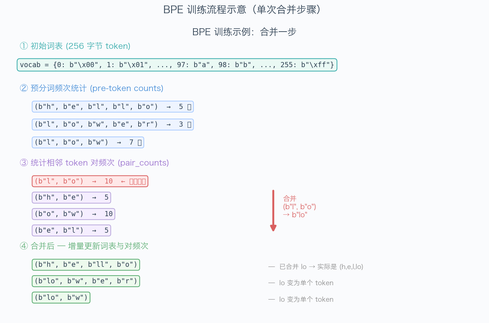

---

### 1.2 文件开头：导入与正则表达式 `PAT`

```python
import os, re, json, regex, multiprocessing
from collections import defaultdict
from typing import Any, Iterator, Iterable

PAT = r"""'(?:[sdmt]|ll|ve|re)| ?\p{L}+| ?\p{N}+| ?[^\s\p{L}\p{N}]+|\s+(?!\S)|\s+"""
```

**`PAT` 是什么？**

GPT-2 使用的**预分词正则表达式**。"预分词"指在 BPE 之前，先把文本按语义边界切成小块（称为 pre-token 或 word），BPE **不会**跨越这些边界合并。

例如 `"don't"` 会被切成 `["don", "'t"]`，而不是 `["do", "n't"]` 或 `["don't"]`。

**为什么需要预分词？**  
如果不限制合并边界，BPE 可能把空格和字母合并成一个 token，让解码后的文本出现奇怪的空格问题。GPT-2 的正则确保了单词边界、数字、标点不会相互混淆。

**`regex` vs `re`**  
这里 `import regex`（第三方库）而非标准库 `re`，因为 `PAT` 用到了 `\p{L}`（Unicode 字母类）和 `\p{N}`（Unicode 数字类），这是 PCRE 扩展语法，标准库 `re` 不支持。

---

### 1.3 `_find_chunk_boundaries` — 文件分块

```python
def _find_chunk_boundaries(file, desired_num_chunks, split_special_token):
    file.seek(0, os.SEEK_END)
    file_size = file.tell()
    file.seek(0)

    chunk_size = file_size // desired_num_chunks
    chunk_boundaries = [i * chunk_size for i in range(desired_num_chunks + 1)]
    chunk_boundaries[-1] = file_size

    mini_chunk_size = 4096
    for bi in range(1, len(chunk_boundaries) - 1):
        initial_position = chunk_boundaries[bi]
        file.seek(initial_position)
        while True:
            mini_chunk = file.read(mini_chunk_size)
            if mini_chunk == b"":
                chunk_boundaries[bi] = file_size
                break
            found_at = mini_chunk.find(split_special_token)
            if found_at != -1:
                chunk_boundaries[bi] = initial_position + found_at
                break
            initial_position += mini_chunk_size

    return sorted(set(chunk_boundaries))
```

**功能：** 把一个大文件切成若干块，返回每块的字节偏移量边界，供多进程并行处理。

**核心问题：** 为什么不能直接按字节数均分？

语料文件由多篇文档组成，文档之间用特殊 token（如 `<|endoftext|>`）分隔。如果在文档中间截断，一个句子就会被拆成两半，分别在不同进程里被处理，可能导致这个句子的 pre-token 统计出错。

**实现策略：**
1. 先计算"理想切割点"（均匀切分）
2. 对每个中间切割点，从该位置向后扫描，找到最近的 `split_special_token`（如 `b"<|endoftext|>"`）
3. 把边界对齐到特殊 token 位置

具体代码流程：
- `file.seek(0, os.SEEK_END)` + `file.tell()` 获取文件字节大小
- 初始化均匀边界 `chunk_boundaries`
- 对每个中间边界点，每次读取 4096 字节（mini_chunk），用 `bytes.find()` 搜索特殊 token 的起始位置
- 找到后更新该边界点为特殊 token 的字节偏移

---

### 1.4 `_pretokenize_chunk` — 并行 Worker

```python
def _pretokenize_chunk(args: tuple) -> dict:
    file_path, start, end, special_tokens = args

    with open(file_path, "rb") as f:
        f.seek(start)
        raw_bytes = f.read(end - start)

    chunk = raw_bytes.decode("utf-8", errors="ignore")

    if special_tokens:
        escaped = [re.escape(st) for st in sorted(special_tokens, key=len, reverse=True)]
        split_pat = "|".join(escaped)
        parts = re.split(f"({split_pat})", chunk)
    else:
        parts = [chunk]

    pretoken_counts: dict[tuple, int] = defaultdict(int)
    special_tokens_set = set(special_tokens) if special_tokens else set()

    for part in parts:
        if not part:
            continue
        if part in special_tokens_set:
            continue
        for match in regex.finditer(PAT, part):
            word = match.group(0)
            word_bytes_tuple = tuple(bytes([b]) for b in word.encode("utf-8"))
            pretoken_counts[word_bytes_tuple] += 1

    return dict(pretoken_counts)
```

**功能：** 这是多进程中每个 Worker 执行的函数。它接收文件路径和字节范围，返回该块的 pre-token 频次统计。

**步骤详解：**

① **读取块数据**  
`f.seek(start)` 跳到起始字节，`f.read(end - start)` 只读这一块。解码时用 `errors="ignore"` 跳过非法 UTF-8 字节（极少发生，但健壮处理）。

② **按特殊 token 分割**  
`re.split(f"({split_pat})", chunk)` 中的括号 `()` 使分隔符本身也出现在结果列表里（Python `re.split` 的行为）。这样可以精确地把特殊 token 从普通文本中分离出来，之后跳过它们，不参与 BPE 统计。

特殊 token 按长度**从长到短**排序再构建正则，是为了**最长匹配优先**：例如 `<|endoftext|>` 和 `<|end|>` 同时存在时，应该先匹配完整的 `<|endoftext|>`，而不是先匹配 `<|end|>`。

③ **GPT-2 正则预分词**  
`regex.finditer(PAT, part)` 遍历每个 pre-token（word），将其 UTF-8 编码的每个字节单独拆成一个元素，形成 `tuple[bytes, ...]`，作为字典的 key 统计频次。

例如 `"hello"` → `(b'h', b'e', b'l', b'l', b'o')` → 频次 +1。

---

### 1.5 `train_bpe` — 核心训练函数（第一部分：初始化与预分词）

```python
def train_bpe(input_path, vocab_size, special_tokens, **kwargs):
    # Step 1: 初始化词表
    vocab: dict[int, bytes] = {}
    idx = 0
    for token in special_tokens:
        vocab[idx] = token.encode("utf-8")
        idx += 1
    for byte_val in range(256):
        vocab[idx] = bytes([byte_val])
        idx += 1

    num_merges = vocab_size - len(vocab)
    if num_merges <= 0:
        return vocab, []
```

**初始词表构建：**

- 特殊 token 优先分配 ID（从 0 开始）
- 然后是 256 个字节值，每个字节 `bytes([b])` 是一个长度为 1 的字节串
- `num_merges` 是需要合并的次数 = `vocab_size` - 当前词表大小

**为什么特殊 token 排在前面？**  
这是约定俗成的做法，让 `<|endoftext|>` 等特殊 token 有固定且较小的 ID（如 0），方便后续处理。

---

### 1.6 `train_bpe` — 并行预分词

```python
    split_token = special_tokens[0].encode("utf-8") if special_tokens else b"\n"
    num_processes = max(1, multiprocessing.cpu_count())

    with open(input_path, "rb") as f:
        boundaries = _find_chunk_boundaries(f, num_processes, split_token)

    chunk_args = [
        (str(input_path), boundaries[i], boundaries[i + 1], special_tokens)
        for i in range(len(boundaries) - 1)
        if boundaries[i] < boundaries[i + 1]
    ]

    pretoken_counts: dict[tuple, int] = defaultdict(int)

    if len(chunk_args) > 1:
        with multiprocessing.Pool(num_processes) as pool:
            results = pool.map(_pretokenize_chunk, chunk_args)
    else:
        results = [_pretokenize_chunk(a) for a in chunk_args]

    for result in results:
        for word_tuple, count in result.items():
            pretoken_counts[word_tuple] += count
```

**为什么用多进程？**

预分词是纯 CPU 密集型任务（大量字符串操作），而 Python 的 GIL（全局解释器锁）让多线程无法真正并行。`multiprocessing.Pool` 创建多个**独立进程**，每个进程有自己的 Python 解释器，可以真正并行地处理不同文件块。

**`pool.map(func, args_list)`** 把参数列表分发给各进程，收集所有结果后返回。

最后把各进程的结果合并（相同 word_tuple 的频次相加），得到整个语料的 pre-token 频次统计。

---

### 1.7 `train_bpe` — BPE 合并循环（最重要的部分）

```python
    # 构建数据结构
    words: dict[int, tuple[list[bytes], int]] = {
        i: (list(word_tuple), count)
        for i, (word_tuple, count) in enumerate(pretoken_counts.items())
    }

    pair_counts: dict[tuple[bytes, bytes], int] = defaultdict(int)
    pair_to_words: dict[tuple[bytes, bytes], set[int]] = defaultdict(set)

    for word_id, (tokens, count) in words.items():
        for i in range(len(tokens) - 1):
            pair = (tokens[i], tokens[i + 1])
            pair_counts[pair] += count
            pair_to_words[pair].add(word_id)
```

**两个关键数据结构：**

- **`words`**：`word_id → (token_list, frequency)`  
  每个 word_id 代表一种不同的 pre-token 字节序列。`token_list` 是当前合并状态下的字节列表（初始为单字节列表），`frequency` 是该 pre-token 在语料中出现的次数。

- **`pair_counts`**：`(bytes_a, bytes_b) → total_count`  
  记录每对相邻 token 在整个语料中的**总出现次数**（= 该对在各 word 中的出现次数 × 该 word 的频次之和）。

- **`pair_to_words`**：`(bytes_a, bytes_b) → {word_id, ...}`  
  反向索引：哪些 word 包含这对 token。这是**增量更新的关键**。

**为什么要有反向索引？**

朴素做法是每次合并后重新扫描所有词来更新 pair_counts，时间复杂度是 O(语料大小)。对于大语料，这会非常慢。

有了 `pair_to_words`，每次合并时只需要更新**包含被合并对的那些词**，复杂度降为 O(受影响词数 × 平均词长)，大幅提速。

---

```python
    merges: list[tuple[bytes, bytes]] = []

    for _ in range(num_merges):
        if not pair_counts:
            break

        best_pair = max(pair_counts, key=lambda p: (pair_counts[p], p))

        if pair_counts[best_pair] <= 0:
            break

        merged = best_pair[0] + best_pair[1]
        merges.append(best_pair)
        vocab[idx] = merged
        idx += 1
```

**选择最佳对：**

`max(pair_counts, key=lambda p: (pair_counts[p], p))`

排序键是一个**元组 `(频次, 对本身)`**，Python 对元组比较时按字段依次比较。这意味着：
- 首先比较频次（越高越好）
- 频次相同时，按字节对本身的字典序排（确保结果确定性，让不同机器训练出来的分词器完全一致）

将 `best_pair[0] + best_pair[1]` 字节拼接，创建新 token，加入词表。

---

```python
        affected_words = list(pair_to_words.get(best_pair, set()))

        for word_id in affected_words:
            tokens, count = words[word_id]

            # 先减去旧贡献
            for i in range(len(tokens) - 1):
                pair = (tokens[i], tokens[i + 1])
                pair_counts[pair] -= count
                pair_to_words[pair].discard(word_id)
                if pair_counts[pair] <= 0 and pair in pair_counts:
                    del pair_counts[pair]

            # 应用合并
            new_tokens: list[bytes] = []
            i = 0
            while i < len(tokens):
                if (i < len(tokens) - 1
                        and tokens[i] == best_pair[0]
                        and tokens[i + 1] == best_pair[1]):
                    new_tokens.append(merged)
                    i += 2
                else:
                    new_tokens.append(tokens[i])
                    i += 1

            words[word_id] = (new_tokens, count)

            # 加回新贡献
            for i in range(len(new_tokens) - 1):
                pair = (new_tokens[i], new_tokens[i + 1])
                pair_counts[pair] = pair_counts.get(pair, 0) + count
                pair_to_words[pair].add(word_id)

        if best_pair in pair_to_words:
            del pair_to_words[best_pair]
```

**增量更新逻辑（最精妙的部分）：**

以 word `(b'a', b'b', b'c')` 频次为 3，合并 `(b'a', b'b')` 为例：

**合并前** pair_counts 中包含：
- `(b'a', b'b')` 的贡献：3
- `(b'b', b'c')` 的贡献：3

**第一步：先减去旧贡献**  
先遍历旧 token 列表，把所有相邻对的贡献从 pair_counts 中减掉。这样 pair_counts 完全不包含这个词的信息了，可以安全地在"合并后"重新计算。

**第二步：执行合并**  
线性扫描 tokens，遇到 `(best_pair[0], best_pair[1])` 就替换为 merged，否则原样保留。注意 `i += 2` 跳过了被合并的两个元素。

**第三步：加回新贡献**  
合并后新的相邻对（如 `(merged, b'c')`），把它们的贡献加回 pair_counts，并更新 pair_to_words。

这样每次合并只修改受影响的词，而不需要重新扫描整个语料。

---

### 1.8 `Tokenizer` 类 — 初始化

```python
class Tokenizer:
    def __init__(self, vocab, merges, special_tokens=None):
        self.vocab = dict(vocab)
        self.merges = list(merges)
        self.special_tokens = list(special_tokens) if special_tokens else []

        # 反向查找：字节串 → token ID
        self.bytes_to_id: dict[bytes, int] = {v: k for k, v in self.vocab.items()}

        # 合并优先级
        self.merge_rank: dict[tuple[bytes, bytes], int] = {
            merge: rank for rank, merge in enumerate(self.merges)
        }

        # 特殊 token 分割正则
        if self.special_tokens:
            escaped = [re.escape(st) for st in sorted(self.special_tokens, key=len, reverse=True)]
            self.special_token_pattern = re.compile(f"({'|'.join(escaped)})")
        else:
            self.special_token_pattern = None
```

**初始化时构建的三个辅助结构：**

1. **`bytes_to_id`**：将 vocab 反转。编码时需要"给我 token 字节串，我要查它的 ID"，而 vocab 是 ID → bytes 的方向，所以需要反转。

2. **`merge_rank`**：`(bytes_a, bytes_b) → rank`（rank = 该合并在训练时的顺序，越小表示越早被发现，即越频繁）。编码时按 rank 从小到大应用合并，就等价于重播 BPE 训练过程。

3. **`special_token_pattern`**：特殊 token 的正则表达式，用于在编码时先把文本按特殊 token 分割，确保特殊 token 不被拆分。`re.escape` 转义特殊 token 中可能有的正则特殊字符（如 `|`、`(`、`)`）。

---

### 1.9 `_apply_bpe_fast` — BPE 编码核心

```python
def _apply_bpe_fast(self, word_bytes: list[bytes]) -> list[bytes]:
    if len(word_bytes) <= 1:
        return word_bytes

    tokens = list(word_bytes)

    while len(tokens) > 1:
        best_pair = None
        best_rank = float("inf")

        for i in range(len(tokens) - 1):
            pair = (tokens[i], tokens[i + 1])
            rank = self.merge_rank.get(pair, float("inf"))
            if rank < best_rank:
                best_rank = rank
                best_pair = pair

        if best_pair is None or best_rank == float("inf"):
            break

        merged = best_pair[0] + best_pair[1]
        new_tokens: list[bytes] = []
        i = 0
        while i < len(tokens):
            if (i < len(tokens) - 1
                    and tokens[i] == best_pair[0]
                    and tokens[i + 1] == best_pair[1]):
                new_tokens.append(merged)
                i += 2
            else:
                new_tokens.append(tokens[i])
                i += 1
        tokens = new_tokens

    return tokens
```

**功能：** 对一个 pre-token（初始为单字节列表），按训练时的合并顺序，逐步合并成最终的 token 序列。

**算法：重复执行"找最高优先级合并，全部替换"**

每轮循环：
1. 扫描所有相邻对，找 rank 最小（最早训练出来的）合并
2. 把所有出现此对的位置**全部合并**
3. 重复，直到没有可用合并

这与训练时的合并顺序完全一致：训练时先创建的 token（rank 小），在编码时也先被应用。

**与 `_apply_bpe` 的区别**  
`_apply_bpe` 每次只合并第一个找到的最佳对（然后重新扫描）；`_apply_bpe_fast` 每次把所有最佳对全部合并，通常轮数更少，效率更高。

---

### 1.10 `encode` — 文本编码

```python
def encode(self, text: str) -> list[int]:
    token_ids: list[int] = []

    if self.special_token_pattern:
        parts = self.special_token_pattern.split(text)
    else:
        parts = [text]

    for part in parts:
        if not part:
            continue
        if part in set(self.special_tokens):
            token_id = self.bytes_to_id[part.encode("utf-8")]
            token_ids.append(token_id)
        else:
            for match in regex.finditer(PAT, part):
                word = match.group(0)
                word_bytes = [bytes([b]) for b in word.encode("utf-8")]
                merged_bytes = self._apply_bpe_fast(word_bytes)
                for token_bytes in merged_bytes:
                    token_ids.append(self.bytes_to_id[token_bytes])

    return token_ids
```

**编码流程：**

1. **特殊 token 分割**：`special_token_pattern.split(text)` 把文本切成若干段，其中特殊 token 作为独立段出现（因为正则中有捕获组 `(...)`）。

2. **逐段处理**：
   - 如果这段是特殊 token → 直接映射为对应 ID，`token_ids.append(...)`
   - 否则 → 用 GPT-2 正则遍历每个 pre-token，字节化后用 `_apply_bpe_fast` 合并，把结果 ID 追加到列表

3. **字节化**：`word.encode("utf-8")` 把字符串变成字节序列，`[bytes([b]) for b in ...]` 把每个字节拆成独立的单字节 bytes 对象，形成初始 token 列表。

**示例**：`"Hello<|endoftext|>"`
- 分割后：`["Hello", "<|endoftext|>", ""]`
- `"Hello"` → 预分词 → `["Hello"]` → 字节化 → BPE 合并 → `[b'Hello']` → ID
- `"<|endoftext|>"` → 特殊 token → 直接查 ID
- `""` → 跳过

---

### 1.11 `decode` — ID 序列解码

```python
def decode(self, ids: list[int]) -> str:
    all_bytes = b"".join(self.vocab[id_] for id_ in ids)
    return all_bytes.decode("utf-8", errors="replace")
```

**功能：** 把 token ID 列表还原为字符串。

**实现：**
- 用 `self.vocab[id_]` 查每个 ID 对应的字节串
- `b"".join(...)` 把所有字节串拼成一个大字节串
- `.decode("utf-8", errors="replace")` 解码为字符串，对无效 UTF-8 字节用 `U+FFFD`（`？`替换符）代替，而不是抛出异常

**为什么先拼后解码？**  
一个 Unicode 字符可能被拆成多个字节对应多个 token（例如中文字符是 3 字节 UTF-8）。如果逐个 token 解码，每个 token 单独的字节可能不是完整的 UTF-8 序列，会报错。先全部拼成字节串，再整体解码，就能正确处理跨 token 边界的多字节字符。

---

## 2. nn_utils.py — 神经网络基础组件

### 2.1 `Linear` — 无偏置线性变换

```python
class Linear(nn.Module):
    def __init__(self, in_features, out_features, device=None, dtype=None):
        super().__init__()
        self.weight = nn.Parameter(
            torch.empty(out_features, in_features, device=device, dtype=dtype)
        )
        std = math.sqrt(2.0 / (in_features + out_features))
        nn.init.trunc_normal_(self.weight, mean=0.0, std=std, a=-3*std, b=3*std)

    def forward(self, x):
        return x @ self.weight.T
```

**功能：** 实现 `y = xW^T`，即线性变换（不含偏置项 bias）。

**为什么不要偏置项？**  
现代大语言模型（LLaMA、GPT-3 等）通常省略 bias。原因是：在 Pre-norm 架构中，RMSNorm 已经调整了每层的缩放，bias 带来的额外自由度收益不大，反而会让模型的分布更难分析。

**权重矩阵的形状：`(out_features, in_features)`**  
存储为 `(d_out, d_in)` 而非 `(d_in, d_out)` 是 PyTorch 的约定。前向传播时用 `x @ weight.T`，转置后变成 `(d_in, d_out)`，矩阵乘法正好得到 `(..., d_out)`。

**Glorot/Xavier 截断正态初始化**  
- 标准差 `σ = sqrt(2 / (d_in + d_out))`  
- 截断于 `[-3σ, 3σ]`（避免极端初始值导致梯度问题）

初始化的目的是让前向传播中激活值的方差大致保持不变（不随层数爆炸或消失），这样训练初期梯度传播更稳定。

**`nn.Parameter`**  
用 `nn.Parameter` 包裹 tensor，告诉 PyTorch 这个 tensor 需要梯度，会被 `model.parameters()` 收集，也会被 `state_dict()` 保存。

---

### 2.2 `Embedding` — Token 嵌入层

```python
class Embedding(nn.Module):
    def __init__(self, num_embeddings, embedding_dim, device=None, dtype=None):
        super().__init__()
        self.weight = nn.Parameter(
            torch.empty(num_embeddings, embedding_dim, device=device, dtype=dtype)
        )
        nn.init.trunc_normal_(self.weight, mean=0.0, std=1.0, a=-3.0, b=3.0)

    def forward(self, token_ids):
        return self.weight[token_ids]
```

**功能：** 把整数 token ID 查找为 `d_model` 维的稠密向量。

**核心操作 `self.weight[token_ids]`**  
这是 PyTorch 的张量索引。`weight` 的形状是 `(vocab_size, d_model)`，用整数张量 `token_ids`（形状 `(batch, seq_len)`）去索引，得到对应行，形状为 `(batch, seq_len, d_model)`。

这等价于对每个 token ID 取 one-hot 向量后乘以嵌入矩阵，但直接索引比矩阵乘法快得多。

**初始化标准差为 1.0**  
嵌入层的初始化通常比线性层更大，因为嵌入向量会被直接加到残差流中，适当的初始化有助于训练开始时的梯度传播。

---

### 2.3 `RMSNorm` — 均方根层归一化

```python
class RMSNorm(nn.Module):
    def __init__(self, d_model, eps=1e-5, device=None, dtype=None):
        super().__init__()
        self.eps = eps
        self.weight = nn.Parameter(torch.ones(d_model, device=device, dtype=dtype))

    def forward(self, x):
        in_dtype = x.dtype
        x = x.to(torch.float32)

        rms = torch.sqrt(torch.mean(x ** 2, dim=-1, keepdim=True) + self.eps)
        result = x / rms * self.weight

        return result.to(in_dtype)
```

**功能：** 归一化操作，让每个位置的特征向量在 d_model 维度上具有单位 RMS（均方根）。

**公式：**  
$$\text{RMSNorm}(x_i) = \frac{x_i}{\text{RMS}(x)} \cdot g_i, \quad \text{RMS}(x) = \sqrt{\frac{1}{d}\sum_i x_i^2 + \epsilon}$$

**为什么用 RMSNorm 而不是 LayerNorm？**  
标准 LayerNorm 计算均值和方差（两步），RMSNorm 只计算方差（一步）。研究发现去掉均值中心化这一步，效果基本不变，但计算量更少。LLaMA 等模型全部采用 RMSNorm。

**`keepdim=True`**  
计算 RMS 时保持维度，形状从 `(..., d_model)` 变为 `(..., 1)`，这样在除法 `x / rms` 时可以广播到 `(..., d_model)`。

**`eps = 1e-5`**  
防止分母为零（当输入向量全为零时，RMS 为 0）。

下图对比了 RMSNorm 与 LayerNorm 的公式差异，以及归一化前后的分布变化：

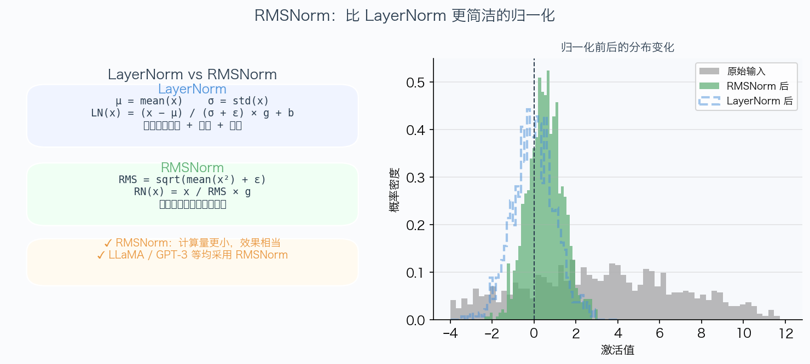

**Upcast 到 float32**  
如果输入是 float16 或 bfloat16，`x ** 2` 的值可能超出这些格式的表示范围（溢出）。先转到 float32 计算归一化，结果再转回原始精度，避免数值错误。

**可学习增益 `self.weight`**  
初始化为全 1，训练后可以调整每个特征维度的缩放。没有偏置项（与 LayerNorm 不同）。

---

### 2.4 `silu` — SiLU 激活函数

```python
def silu(x: torch.Tensor) -> torch.Tensor:
    return x * torch.sigmoid(x)
```

**公式：** `SiLU(x) = x · σ(x) = x / (1 + e^{-x})`

**与 ReLU 对比：**

| 特性 | ReLU | SiLU |
|------|------|------|
| 负值区域 | 直接截断为 0（死亡 ReLU 问题）| 允许小负值通过，梯度不为 0 |
| 零点处 | 不可微（折角）| 平滑可微 |
| 正值区域 | 线性 | 近似线性（当 x 较大时 σ(x) → 1）|

SiLU 也叫 Swish，在 transformer 的前馈网络中被实验验证优于 ReLU 和 GELU。

**实现仅一行代码**，利用 PyTorch 的逐元素操作：`torch.sigmoid(x)` 计算 sigmoid，`x * ...` 逐元素相乘。

---

### 2.5 `SwiGLU` — 门控前馈网络

```python
class SwiGLU(nn.Module):
    def __init__(self, d_model, d_ff=None, device=None, dtype=None):
        super().__init__()
        if d_ff is None:
            d_ff_raw = int(8 / 3 * d_model)
            d_ff = ((d_ff_raw + 63) // 64) * 64

        self.d_ff = d_ff
        self.w1 = Linear(d_model, d_ff, device=device, dtype=dtype)
        self.w2 = Linear(d_ff, d_model, device=device, dtype=dtype)
        self.w3 = Linear(d_model, d_ff, device=device, dtype=dtype)

    def forward(self, x):
        gate = silu(self.w1(x))
        up = self.w3(x)
        gated = gate * up
        return self.w2(gated)
```

**功能：** SwiGLU 门控前馈网络，是 LLaMA 系列模型的标准前馈层。

**公式：** `FFN(x) = W₂ · (SiLU(W₁x) ⊙ W₃x)`

**三个线性层的含义：**

- **`w1`**（门控投影 gate projection）：`x → d_ff`，通过 SiLU 产生"门"值，控制哪些特征通过
- **`w3`**（值投影 up projection）：`x → d_ff`，产生"值"，是实际被门控的内容  
- **`w2`**（下投影 down projection）：`d_ff → d_model`，压缩回模型维度

**门控机制（GLU, Gated Linear Unit）：**  
`gate * up` 是逐元素乘法。`gate` 的每个元素都是 0 到 1 之间的值（SiLU 的输出），相当于对 `up` 的每个维度进行"软开关"——gate 值接近 0 就关闭这个特征，接近 1 就让它通过。这让模型能动态地根据输入内容决定传递哪些信息。

**为什么 d_ff ≈ 8/3 · d_model？**  
标准 Transformer 的 FFN 是 d_ff = 4 · d_model（两个矩阵）。SwiGLU 用三个矩阵，为了保持总参数量相近，每个矩阵的维度缩小为 `4 * (2/3) ≈ 8/3`。向上取 64 的倍数是为了让矩阵维度适合 GPU 的矩阵乘法单元（WMMA/Tensor Core），提高计算效率。

下图直观展示了 SwiGLU 的门控数据流（gate 分支控制 up 分支的信息通过量）：

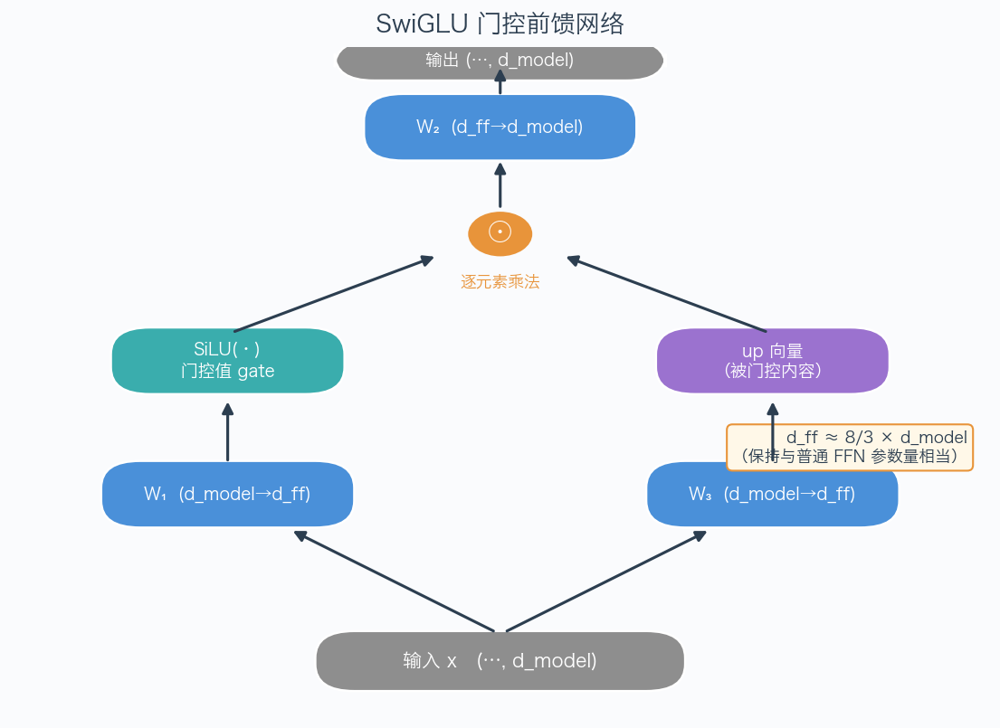

---

### 2.6 `RotaryPositionalEmbedding` — 旋转位置编码

**背景：为什么需要位置编码？**

自注意力机制本身是"置换不变"的——如果把序列中的 token 打乱顺序，得到的结果是对应打乱的结果（attention 本身不知道顺序）。为了让模型感知位置信息，需要给每个位置注入编码。

**RoPE 的思想：** 不像 Transformer 原始论文那样直接把位置嵌入加到 token 向量，而是在计算注意力时，对 Q 和 K 的每对维度施加位置相关的**旋转**。这样，Q·K 的内积自然包含了相对位置信息。

```python
class RotaryPositionalEmbedding(nn.Module):
    def __init__(self, theta, d_k, max_seq_len, device=None):
        super().__init__()
        self.d_k = d_k
        self.max_seq_len = max_seq_len

        dim_indices = torch.arange(0, d_k, 2, dtype=torch.float32, device=device)
        inv_freq = 1.0 / (theta ** (dim_indices / d_k))

        positions = torch.arange(max_seq_len, dtype=torch.float32, device=device)
        angles = torch.outer(positions, inv_freq)

        self.register_buffer("cos_buffer", torch.cos(angles), persistent=False)
        self.register_buffer("sin_buffer", torch.sin(angles), persistent=False)
```

**预计算阶段：**

- `dim_indices = [0, 2, 4, ..., d_k-2]`（步长为 2，共 d_k/2 个值）
- `inv_freq[k] = 1 / θ^(2k/d_k)`：每对维度对应一个频率，高维度对应低频率（位置变化缓慢）
- `angles[i, k] = position_i × inv_freq[k]`：位置 i、维度对 k 的旋转角度
- 预先计算好 cos 和 sin，存储为不可训练的 buffer（不作为模型参数，但会随 `.to(device)` 移动）

**`torch.outer(a, b)`**：外积，`a` 是 `(m,)`，`b` 是 `(n,)`，结果是 `(m, n)`，其中 `result[i, j] = a[i] * b[j]`。

下图左侧展示了不同位置在一对维度上的旋转效果；右侧展示了旋转频率随维度序号的变化规律（高维度 = 低频 = 慢变化）：

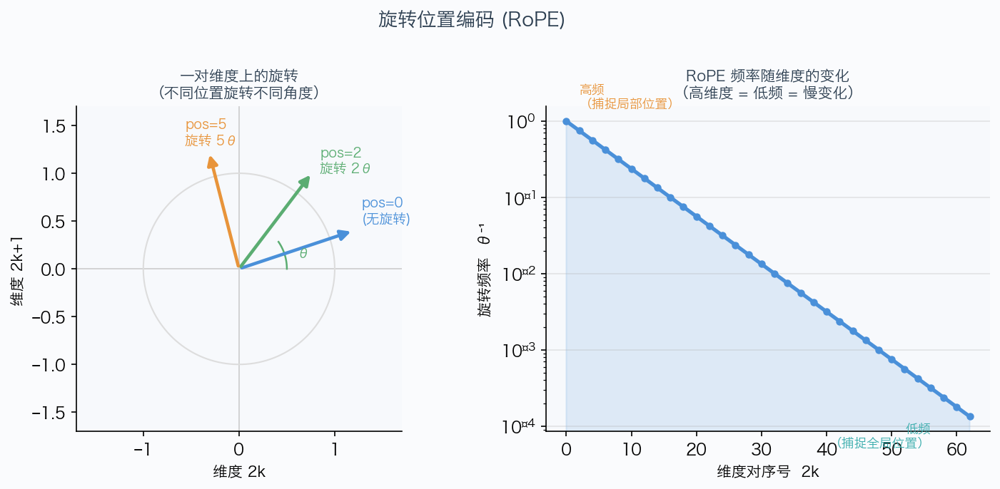

---

```python
    def forward(self, x, token_positions):
        cos = self.cos_buffer[token_positions]  # (..., seq_len, d_k/2)
        sin = self.sin_buffer[token_positions]

        x_even = x[..., ::2]   # 偶数下标维度
        x_odd  = x[..., 1::2]  # 奇数下标维度

        x_rot_even = x_even * cos - x_odd * sin
        x_rot_odd  = x_even * sin + x_odd * cos

        x_rotated = torch.stack([x_rot_even, x_rot_odd], dim=-1)
        return x_rotated.flatten(-2)
```

**旋转应用阶段：**

对每对相邻维度 `(x_{2k}, x_{2k+1})`，应用 2D 旋转：

$$\begin{pmatrix} x'_{2k} \\ x'_{2k+1} \end{pmatrix} = \begin{pmatrix} \cos\theta_k & -\sin\theta_k \\ \sin\theta_k & \cos\theta_k \end{pmatrix} \begin{pmatrix} x_{2k} \\ x_{2k+1} \end{pmatrix}$$

- `x[..., ::2]`：取所有偶数下标的维度（下标 0, 2, 4, ...）
- `x[..., 1::2]`：取所有奇数下标的维度（下标 1, 3, 5, ...）
- 分别计算旋转后的值
- `torch.stack([x_rot_even, x_rot_odd], dim=-1)` 将偶数维和奇数维交错堆叠，形状变为 `(..., d_k/2, 2)`
- `.flatten(-2)` 展平最后两维，恢复为 `(..., d_k)`

**直觉：** 每对相邻维度在一个 2D 平面上旋转，旋转角度与位置成正比。两个位置的 Q、K 内积会包含 `cos(位置差 × 频率)` 这样的项，从而编码了相对位置。

---

### 2.7 `scaled_dot_product_attention` — 缩放点积注意力

```python
def scaled_dot_product_attention(Q, K, V, mask=None):
    d_k = Q.shape[-1]

    scores = einsum(Q, K, "... q d, ... k d -> ... q k") / math.sqrt(d_k)

    if mask is not None:
        scores = scores.masked_fill(~mask, float("-inf"))

    scores_max = scores.max(dim=-1, keepdim=True).values
    scores_max = torch.where(torch.isinf(scores_max),
                             torch.zeros_like(scores_max), scores_max)
    scores_shifted = scores - scores_max
    exp_scores = torch.exp(scores_shifted)

    if mask is not None:
        exp_scores = exp_scores.masked_fill(~mask, 0.0)

    attn_weights = exp_scores / (exp_scores.sum(dim=-1, keepdim=True) + 1e-9)

    output = einsum(attn_weights, V, "... q k, ... k d -> ... q d")
    return output
```

**功能：** 计算 `Attention(Q, K, V) = softmax(QK^T / √d_k) V`。

**`einsum` 的作用：**  
`einops.einsum` 用 Einstein 求和符号清晰表达张量运算。

`"... q d, ... k d -> ... q k"` 表示：
- `Q` 的形状 `(... queries d_k)`，`K` 的形状 `(... keys d_k)`
- `d` 维度被求和（内积），`q` 和 `k` 保留
- 结果形状 `(... queries keys)`

这等价于 `Q @ K.transpose(-1, -2)` 但语义更清晰。

**缩放因子 `1/√d_k` 的作用：**  
如果 Q 和 K 的各元素是标准正态分布，那么 Q·K 的方差随 d_k 线性增长。不缩放时，d_k 很大时点积值会很大，导致 softmax 落入饱和区（梯度近乎为零）。除以 `√d_k` 把方差归一化为 1，保持 softmax 在有效梯度区域。

**因果掩码（causal mask）：**  
在语言模型中，位置 `i` 的 token 不能看到位置 `j > i` 的 token（否则"偷看"了答案）。`mask[i, j] = True` 表示位置 `i` 可以关注位置 `j`。对于 `mask[i, j] = False` 的位置，设置 scores 为 `-∞`，这样 softmax 后对应的权重趋向 0，即完全不关注。

**数值稳定的 softmax（log-sum-exp trick）：**
- 找每行最大值 `scores_max`（`keepdim=True` 保持维度以便广播）
- 减去最大值：`scores_shifted = scores - scores_max`
- 计算 exp：现在最大值变为 0，exp(0) = 1，不会溢出
- `torch.where(isinf, 0, scores_max)` 处理全 `-∞` 行（如果某 query 被完全屏蔽）

为什么有两次 `masked_fill`？第一次填 `-∞` 用于 softmax 计算，第二次填 `0.0` 用于确保被屏蔽位置的 exp 值精确为 0（数值上 exp(-∞) 应为 0，但浮点计算可能有微小误差）。

下图左侧展示了一个真实的因果注意力权重矩阵热图（红色区域为被掩蔽的"未来位置"），右侧对比了数值稳定 softmax 与朴素 softmax 的差异：

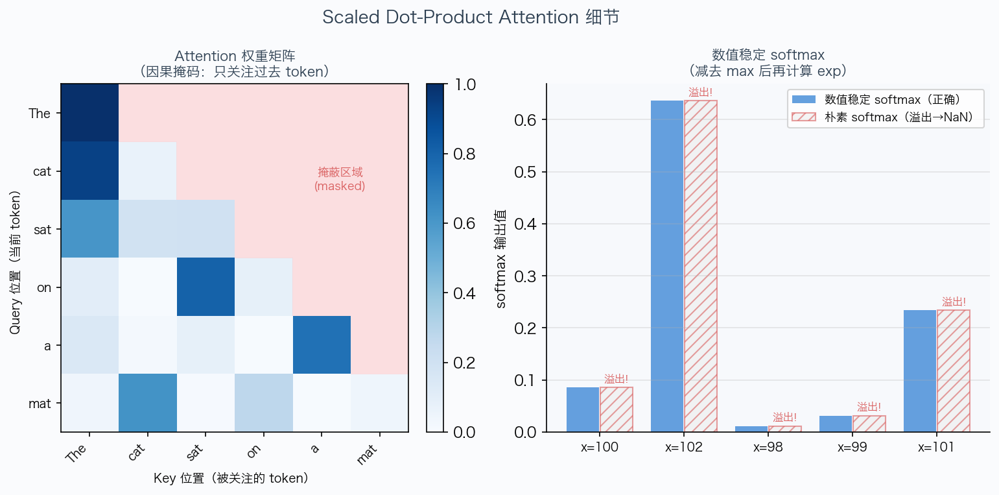

---

### 2.8 `MultiHeadSelfAttention` — 多头自注意力

```python
class MultiHeadSelfAttention(nn.Module):
    def __init__(self, d_model, num_heads, max_seq_len, theta=10000.0, device=None, dtype=None):
        super().__init__()
        assert d_model % num_heads == 0
        self.d_model = d_model
        self.num_heads = num_heads
        self.d_k = d_model // num_heads

        self.q_proj = Linear(d_model, d_model, device=device, dtype=dtype)
        self.k_proj = Linear(d_model, d_model, device=device, dtype=dtype)
        self.v_proj = Linear(d_model, d_model, device=device, dtype=dtype)
        self.output_proj = Linear(d_model, d_model, device=device, dtype=dtype)

        self.rope = RotaryPositionalEmbedding(theta=theta, d_k=self.d_k,
                                              max_seq_len=max_seq_len, device=device)
```

**多头注意力的核心思想：**  
用 `num_heads` 个"注意力头"并行地从输入的不同子空间提取信息。每个头独立学习关注不同的特征（例如一个头关注语法关系，另一个头关注语义关系）。

**关键：用一个大矩阵代替 num_heads 个小矩阵**

实现上，`q_proj` 的形状是 `(d_model, d_model)`，等价于 `num_heads` 个 `(d_k, d_model)` 矩阵拼在一起。计算更高效（一次大矩阵乘法比多次小矩阵乘法更适合 GPU）。

---

```python
    def forward(self, x, token_positions=None):
        *batch_dims, seq_len, _ = x.shape

        if token_positions is None:
            token_positions = torch.arange(seq_len, device=x.device)

        Q = self.q_proj(x)
        K = self.k_proj(x)
        V = self.v_proj(x)

        Q = rearrange(Q, "... s (h d) -> ... h s d", h=self.num_heads)
        K = rearrange(K, "... s (h d) -> ... h s d", h=self.num_heads)
        V = rearrange(V, "... s (h d) -> ... h s d", h=self.num_heads)

        tp = token_positions.unsqueeze(-2).expand(*Q.shape[:-1])
        Q = self.rope(Q, tp)
        K = self.rope(K, tp)

        causal_mask = torch.tril(torch.ones(seq_len, seq_len,
                                            device=x.device, dtype=torch.bool))
        attn_out = scaled_dot_product_attention(Q, K, V, mask=causal_mask)

        attn_out = rearrange(attn_out, "... h s d -> ... s (h d)")
        return self.output_proj(attn_out)
```

**前向传播步骤详解：**

**① 投影**  
`Q = self.q_proj(x)` 形状 `(..., seq_len, d_model)`，同理 K、V。

**② 拆分为多头**  
`rearrange(Q, "... s (h d) -> ... h s d", h=self.num_heads)`  
einops 的 `rearrange` 把最后一维 `d_model = num_heads × d_k` 按 `(h, d)` 分组，然后把头维度 `h` 移到序列维度 `s` 之前。结果形状从 `(..., s, h*d)` 变为 `(..., h, s, d)`。

**③ 广播 token_positions**  
`token_positions` 初始形状是 `(seq_len,)` 或 `(..., seq_len)`。`unsqueeze(-2)` 插入头维度，变为 `(..., 1, seq_len)`；`expand(*Q.shape[:-1])` 广播到 `(..., h, seq_len)`，与 Q 的批次和头维度对齐。

**④ 应用 RoPE**  
对 Q 和 K 各应用旋转位置编码。V 不旋转（V 不参与位置相关的 attention score 计算）。

**⑤ 因果掩码**  
`torch.tril(torch.ones(seq_len, seq_len, dtype=torch.bool))` 生成下三角布尔矩阵。`causal_mask[i, j] = True` 当且仅当 `j ≤ i`，即位置 i 可以关注位置 j（过去和当前）。

**⑥ 注意力计算**  
`scaled_dot_product_attention(Q, K, V, mask=causal_mask)` 输出 `(..., h, s, d_k)`。

**⑦ 合并头**  
`rearrange(attn_out, "... h s d -> ... s (h d)")` 把各头的输出拼接：`(h, s, d_k) → (s, h*d_k) = (s, d_model)`。

**⑧ 输出投影**  
一个线性层把合并后的多头输出映射回 d_model 维，允许不同头之间的信息交互。

下图展示了完整的多头注意力数据流（Q/K/V 投影 → 拆分头 → RoPE → 注意力 → 合并 → 输出投影）：

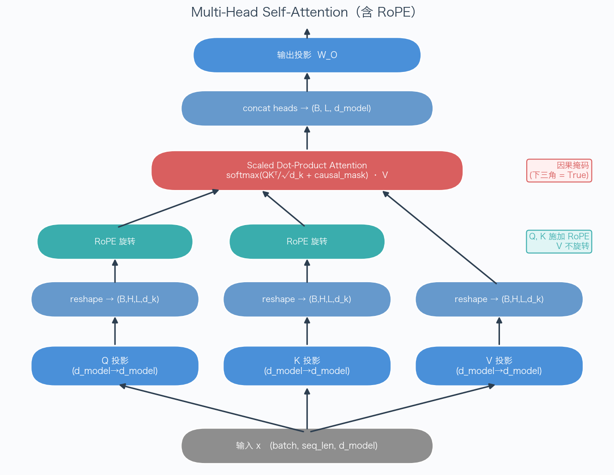

---

## 3. model.py — Transformer 语言模型架构

### 3.1 `TransformerBlock` — Transformer 块

```python
class TransformerBlock(nn.Module):
    def __init__(self, d_model, num_heads, d_ff, max_seq_len, theta, device=None, dtype=None):
        super().__init__()
        self.ln1 = RMSNorm(d_model, device=device, dtype=dtype)
        self.attn = MultiHeadSelfAttention(
            d_model=d_model, num_heads=num_heads,
            max_seq_len=max_seq_len, theta=theta,
            device=device, dtype=dtype,
        )
        self.ln2 = RMSNorm(d_model, device=device, dtype=dtype)
        self.ffn = SwiGLU(d_model=d_model, d_ff=d_ff, device=device, dtype=dtype)

    def forward(self, x, token_positions=None):
        x = x + self.attn(self.ln1(x), token_positions)
        x = x + self.ffn(self.ln2(x))
        return x
```

**功能：** 组合注意力子层和 FFN 子层，加入残差连接，构成一个完整的 Transformer 块。

**Pre-norm（前归一化）架构：**

这里的结构是：
```
x_new = x + Attention(RMSNorm(x))
x_out = x_new + FFN(RMSNorm(x_new))
```

而原始 Transformer 论文的后归一化（Post-norm）是：
```
x_new = RMSNorm(x + Attention(x))
x_out = RMSNorm(x_new + FFN(x_new))
```

**Pre-norm 的优势——"干净的残差流"**

在 Pre-norm 中，从输入 `x` 到输出存在一条不经过任何归一化的直接路径（`x_out = x + ...`）。梯度可以沿这条路径直接从输出反传到输入，几乎不会受到干扰。在后归一化中，每个 RMSNorm 都会改变梯度的大小和方向，梯度传播路径更长更复杂。

实践中，Pre-norm 训练更稳定，不需要像 Post-norm 那样精心调整学习率和 warm-up。

**注意前归一化的一个后果：** 最后一个 TransformerBlock 的输出没有经过归一化，所以 `TransformerLM` 在所有块之后需要额外加一个 `RMSNorm`（即 `ln_final`）。

下图展示了 Pre-norm 残差块的完整结构，包括两条残差连接路径：

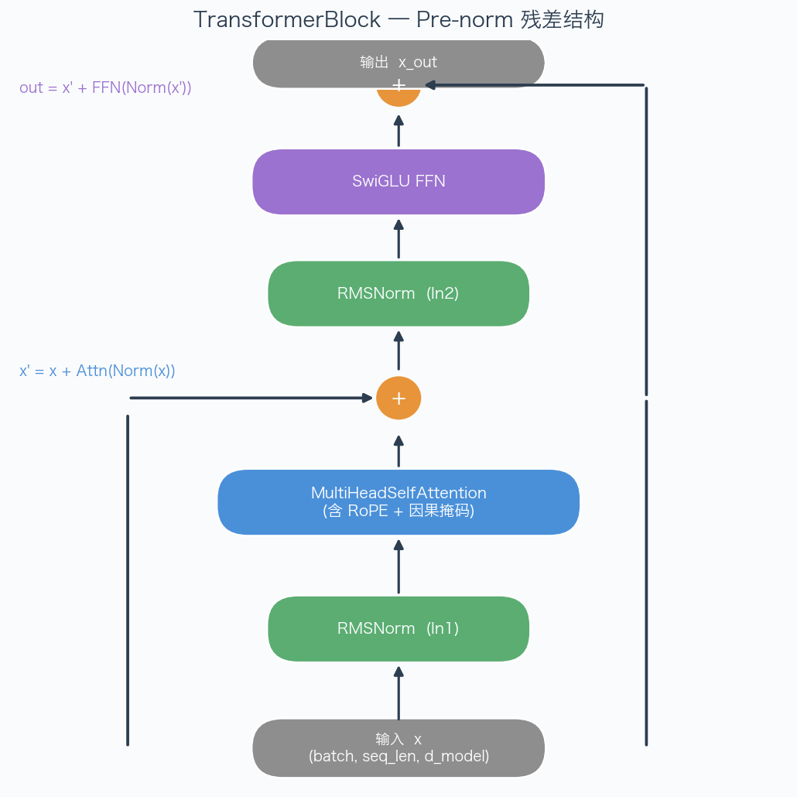

**两行代码实现完整块：**
```python
x = x + self.attn(self.ln1(x), token_positions)  # 注意力子层
x = x + self.ffn(self.ln2(x))                     # FFN 子层
```

每行都是 `x = x + sublayer(norm(x))` 的模式，直白地实现了 pre-norm + 残差连接。

---

### 3.2 `TransformerLM` — 完整语言模型

下图展示了 TransformerLM 的整体架构，从 Token ID 输入到最终 Logits 输出的完整流程：

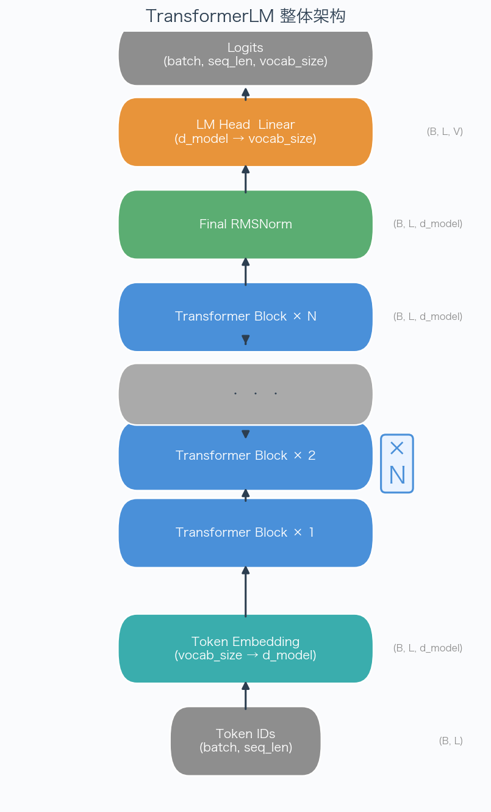

```python
class TransformerLM(nn.Module):
    def __init__(self, vocab_size, context_length, d_model, num_layers,
                 num_heads, d_ff, rope_theta, device=None, dtype=None):
        super().__init__()
        self.token_embeddings = Embedding(vocab_size, d_model, device=device, dtype=dtype)

        self.layers = nn.ModuleList([
            TransformerBlock(
                d_model=d_model, num_heads=num_heads, d_ff=d_ff,
                max_seq_len=context_length, theta=rope_theta,
                device=device, dtype=dtype,
            )
            for _ in range(num_layers)
        ])

        self.ln_final = RMSNorm(d_model, device=device, dtype=dtype)
        self.lm_head = Linear(d_model, vocab_size, device=device, dtype=dtype)
```

**完整架构（自下而上）：**

1. **Token 嵌入层** `token_embeddings`：`(batch, seq_len)` → `(batch, seq_len, d_model)`  
   把整数 ID 查找为向量。

2. **`num_layers` 个 Transformer 块**（通过 `nn.ModuleList` 管理）：  
   每一层接收上一层的输出，进行注意力 + FFN 处理。  
   `nn.ModuleList` 告诉 PyTorch 这些块是子模块，会被 `model.parameters()` 和 `state_dict()` 正确处理。

3. **最终归一化层** `ln_final`：对所有块的最终输出做 RMSNorm。

4. **LM 头** `lm_head`：`(batch, seq_len, d_model)` → `(batch, seq_len, vocab_size)`  
   投影到词表大小，输出每个位置的 logits（未归一化的概率对数）。

---

```python
    def forward(self, token_ids):
        batch_size, seq_len = token_ids.shape

        x = self.token_embeddings(token_ids)  # (batch, seq_len, d_model)

        positions = torch.arange(seq_len, device=token_ids.device)

        for layer in self.layers:
            x = layer(x, positions)

        x = self.ln_final(x)
        logits = self.lm_head(x)
        return logits
```

**前向传播：**

- `positions = torch.arange(seq_len, ...)` 创建位置索引 `[0, 1, 2, ..., seq_len-1]`，传给每个 TransformerBlock 用于 RoPE。
- `for layer in self.layers` 顺序执行每个 Transformer 块。
- 最终返回 `logits`，形状 `(batch, seq_len, vocab_size)`。

**logits 的含义：**  
`logits[b, i, :]` 是模型看到第 `b` 个样本的前 `i+1` 个 token 后，对第 `i+1` 个（下一个）token 的预测分数。对其取 softmax 得到概率分布。训练时，我们希望 `logits[b, i, target_id]` 尽可能大（对应交叉熵损失最小）。

---

## 4. optimizer.py — 优化器与学习率调度

### 4.1 `AdamW` — 优化器原理

**为什么不用简单的梯度下降（SGD）？**

普通 SGD：`θ = θ - lr * g`。问题是：
- 不同参数的梯度大小差异可能很大，固定学习率对某些参数太大、对另一些太小
- 容易陷入鞍点（梯度为零但不是极值）

**Adam** 通过维护梯度的一阶矩（动量）和二阶矩（自适应学习率）解决了这些问题。

**AdamW = Adam + 解耦权重衰减**  
普通 Adam 把权重衰减（L2 正则化）加到梯度里，会被 Adam 的自适应缩放"弱化"。AdamW 把权重衰减直接施加在参数上，不经过自适应缩放，效果更可预测。

---

```python
class AdamW(Optimizer):
    def __init__(self, params, lr=1e-3, betas=(0.9, 0.999), eps=1e-8, weight_decay=0.01):
        # 参数验证
        defaults = dict(lr=lr, betas=betas, eps=eps, weight_decay=weight_decay)
        super().__init__(params, defaults)
```

**继承 `torch.optim.Optimizer`**  
PyTorch 的 `Optimizer` 基类提供了参数组管理（`self.param_groups`）、状态存储（`self.state`）等基础设施。子类只需实现 `step()` 方法。

**超参数说明：**
- `lr`：学习率，控制每步更新的幅度（语言模型通常 1e-4 到 3e-4）
- `betas=(β₁, β₂)`：动量系数，β₁=0.9 表示一阶矩的"半衰期"约为 10 步，β₂=0.999 约为 1000 步
- `eps=1e-8`：防止二阶矩根号为零（数值稳定）
- `weight_decay`：权重衰减系数，相当于 L2 正则化强度

---

```python
    @torch.no_grad()
    def step(self, closure=None):
        loss = None if closure is None else closure()

        for group in self.param_groups:
            lr = group["lr"]
            beta1, beta2 = group["betas"]
            eps = group["eps"]
            weight_decay = group["weight_decay"]

            for p in group["params"]:
                if p.grad is None:
                    continue

                g = p.grad.data
                state = self.state[p]

                if len(state) == 0:
                    state["step"] = 0
                    state["m"] = torch.zeros_like(p.data)
                    state["v"] = torch.zeros_like(p.data)

                state["step"] += 1
                t = state["step"]
                m = state["m"]
                v = state["v"]
```

**`@torch.no_grad()`**  
优化器更新参数的操作不需要构建计算图（不需要对"参数更新"求导），加这个装饰器告诉 PyTorch 跳过梯度追踪，节省内存和计算。

**状态初始化（第一次调用时）：**
- `state["step"]`：当前步数，用于偏差修正
- `state["m"]`：一阶矩估计（梯度的指数加权平均），初始为全零
- `state["v"]`：二阶矩估计（梯度平方的指数加权平均），初始为全零

---

```python
                bias_correction1 = 1.0 - beta1 ** t
                bias_correction2 = 1.0 - beta2 ** t
                alpha_t = lr * math.sqrt(bias_correction2) / bias_correction1

                if weight_decay != 0:
                    p.data.mul_(1.0 - lr * weight_decay)

                m.mul_(beta1).add_(g, alpha=1.0 - beta1)
                v.mul_(beta2).addcmul_(g, g, value=1.0 - beta2)

                p.data.addcdiv_(m, v.sqrt().add_(eps), value=-alpha_t)
```

**四步更新，逐一解析：**

**① 偏差修正学习率**  
初始时 m=0, v=0，估计偏向零。偏差修正因子 `1/(1-β^t)` 在 t 较小时放大估计值，补偿初期偏置。随着 t 增大，`β^t → 0`，修正因子趋向 1，偏差消失。

`alpha_t = lr × √(1 - β₂^t) / (1 - β₁^t)`

**② 解耦权重衰减（AdamW 的核心改动）**  
`p.data.mul_(1.0 - lr * weight_decay)`  
直接将参数乘以 `(1 - lr × λ)`，效果是让参数缓慢地向零衰减（L2 正则化效果），但这个操作**不经过 Adam 的自适应缩放**。`mul_` 末尾的 `_` 表示原地（in-place）操作，节省内存。

**③ 更新一阶矩 m（梯度动量）**  
`m = β₁ × m + (1 - β₁) × g`  
`m.mul_(beta1).add_(g, alpha=1.0 - beta1)` 是就地操作的链式写法。m 是梯度的滑动平均，平滑了梯度噪声。

**④ 更新二阶矩 v（梯度平方动量）**  
`v = β₂ × v + (1 - β₂) × g²`  
`v.mul_(beta2).addcmul_(g, g, value=1.0 - beta2)` 其中 `addcmul_(a, b, value=c)` 是 `+= c × a × b`（逐元素）。v 估计每个参数的梯度方差。

**⑤ 参数更新**  
`p = p - alpha_t × m / (√v + ε)`  
`p.data.addcdiv_(m, v.sqrt().add_(eps), value=-alpha_t)`  
其中 `addcdiv_(a, b, value=c)` 是 `+= c × (a / b)`。

直觉：梯度方差 v 大的参数（梯度变化剧烈）有效学习率小；方差小的参数有效学习率大。这让 Adam 对不同参数自适应地调整学习率。

下图左侧展示了 AdamW 的完整更新流程（蓝色高亮为 AdamW 特有的解耦权重衰减步骤），右侧以模拟数据直观对比高/低梯度方差参数的有效学习率差异：

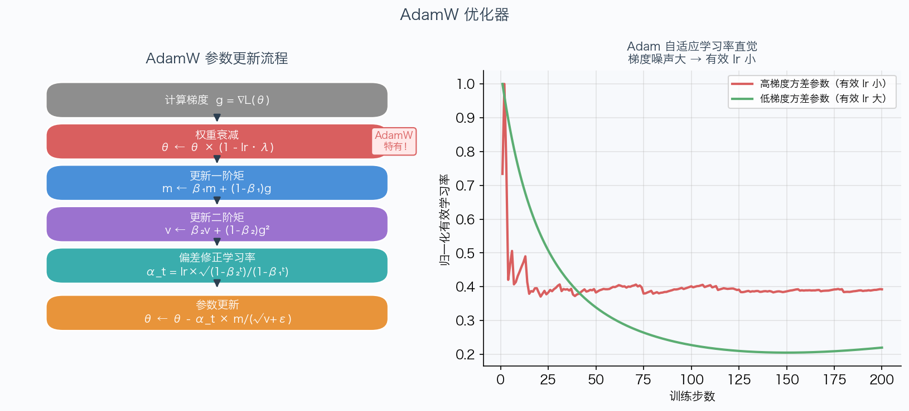

---

### 4.2 `get_lr_cosine_schedule` — 余弦学习率调度

```python
def get_lr_cosine_schedule(it, max_learning_rate, min_learning_rate,
                           warmup_iters, cosine_cycle_iters):
    if it < warmup_iters:
        return max_learning_rate * it / warmup_iters
    elif it <= cosine_cycle_iters:
        progress = (it - warmup_iters) / (cosine_cycle_iters - warmup_iters)
        return min_learning_rate + 0.5 * (1.0 + math.cos(math.pi * progress)) * (
            max_learning_rate - min_learning_rate
        )
    else:
        return min_learning_rate
```

**三个阶段：**

**① 线性预热（`it < warmup_iters`）**  
`lr = max_lr × (it / T_w)`，从 0 线性增长到 max_lr。

为什么需要预热？训练初期参数随机，梯度方差很大，如果直接用大学习率，参数会剧烈震荡，甚至损失变成 NaN。预热让优化器先"慢慢适应"数据分布，等 m 和 v 有了稳定估计后再加速。

**② 余弦退火（`warmup_iters ≤ it ≤ cosine_cycle_iters`）**  
`progress = (it - T_w) / (T_c - T_w)`，从 0 到 1。

`lr = min_lr + 0.5 × (1 + cos(π × progress)) × (max_lr - min_lr)`

当 `progress = 0`：`cos(0) = 1`，`lr = min_lr + (max_lr - min_lr) = max_lr`  
当 `progress = 1`：`cos(π) = -1`，`lr = min_lr + 0 = min_lr`

余弦曲线的形状：在 0 附近下降缓慢（让模型充分学习），接近 π 时下降快（精细调整收敛）。相比线性衰减，余弦调度通常达到更低的最终损失。

**③ 退火后（`it > cosine_cycle_iters`）**  
保持 `min_lr` 不变，用于继续微调。

下图展示了三个阶段的学习率曲线全貌（绿色区域为预热阶段，橙色区域为余弦退火阶段）：

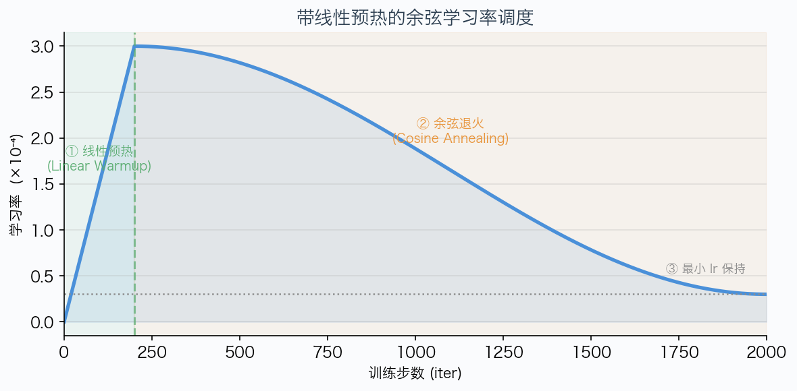

---

### 4.3 `gradient_clipping` — 梯度裁剪

```python
def gradient_clipping(parameters, max_l2_norm):
    eps = 1e-6

    params_with_grad = [p for p in parameters if p.grad is not None]
    if not params_with_grad:
        return

    total_norm_sq = sum(p.grad.data.norm(2).item() ** 2 for p in params_with_grad)
    total_norm = math.sqrt(total_norm_sq)

    if total_norm > max_l2_norm:
        scale = max_l2_norm / (total_norm + eps)
        for p in params_with_grad:
            p.grad.data.mul_(scale)
```

**问题背景：梯度爆炸**  
在训练中，有时会出现某一批次的梯度异常大（loss spike）。如果不加限制，参数更新会导致模型"飞走"，可能需要很多步才能恢复，甚至彻底无法恢复。

**全局 L2 范数裁剪**  
把所有参数的梯度拼成一个大向量，计算整体的 L2 范数：  
`total_norm = √(Σᵢ ||∇θᵢ||²)`

如果超过阈值 M，按比例缩放所有梯度：  
`g_i ← g_i × M / (total_norm + ε)`

**注意是全局范数**，不是每个参数单独裁剪。全局裁剪保持梯度的相对方向不变（只缩放大小），不会因为某个参数有大梯度就过度压制其他参数。

**代码细节：**
- `p.grad.data.norm(2)`：计算该参数梯度的 L2 范数（`.data` 跳过梯度追踪）
- `.item()`：把 tensor 标量转为 Python float，便于用 `sum` 累加
- `eps = 1e-6`：防止 total_norm 很接近 max_l2_norm 时除以接近零的数

---

## 5. training.py — 训练基础设施

### 5.1 `softmax` — 数值稳定的 Softmax

```python
def softmax(x: torch.Tensor, dim: int) -> torch.Tensor:
    x_max = x.max(dim=dim, keepdim=True).values
    x_shifted = x - x_max
    exp_x = torch.exp(x_shifted)
    return exp_x / exp_x.sum(dim=dim, keepdim=True)
```

**数值稳定性问题：**

标准 softmax `exp(x_i) / Σ exp(x_j)` 在 x_i 很大时会导致 `exp(x_i)` 溢出（float32 最大约 3.4×10³⁸，`exp(89)` 已经超过）。

**利用 softmax 的平移不变性：**  
`softmax(x - c) = softmax(x)` 对任意常数 c 成立。

取 `c = max(x)`，使最大元素变为 0，则 `exp(0) = 1`，其他元素的 exp 都不超过 1，不会溢出。

`x.max(dim=dim, keepdim=True).values` 取 dim 维度的最大值，`keepdim=True` 让结果形状与 x 兼容，可以广播相减。

---

### 5.2 `cross_entropy_loss` — 交叉熵损失

```python
def cross_entropy_loss(inputs, targets):
    inputs_max = inputs.max(dim=-1, keepdim=True).values
    inputs_shifted = inputs - inputs_max

    log_sum_exp = torch.log(torch.exp(inputs_shifted).sum(dim=-1))

    target_logits = inputs_shifted.gather(-1, targets.unsqueeze(-1)).squeeze(-1)

    per_sample_loss = log_sum_exp - target_logits
    return per_sample_loss.mean()
```

**公式推导：**

交叉熵损失定义为：  
`ℓ = -log softmax(o)[y] = -log(exp(o[y]) / Σ exp(o[a]))`  
`= -o[y] + log Σ exp(o[a])`

数值稳定版本（减去 max 后）：  
`= -(o[y] - max_o) + log Σ exp(o[a] - max_o)`

**`gather` 操作：**  
`inputs_shifted.gather(-1, targets.unsqueeze(-1))` 是沿最后一维（vocab 维）按索引取值：

- `inputs_shifted` 形状 `(batch, vocab_size)`
- `targets` 形状 `(batch,)`，每个值是 0 到 vocab_size-1 之间的整数（目标类别）
- `targets.unsqueeze(-1)` 变为 `(batch, 1)`
- `gather(-1, ...)` 对每个样本，取第 `targets[i]` 列的值，结果 `(batch, 1)`
- `.squeeze(-1)` 变回 `(batch,)`

**为什么直接用 log-sum-exp 而不是先算 softmax 再取 log？**  
如果先算 softmax（可能出现极小值接近 0），再取 log（log(0) = -∞），会出现数值错误。直接在 log 空间计算避免了这个问题，数值更稳定。

---

### 5.3 `get_batch` — 随机采样训练批次

```python
def get_batch(dataset, batch_size, context_length, device):
    n = len(dataset)
    starts = torch.randint(0, n - context_length, (batch_size,))

    x_list = []
    y_list = []
    for s in starts:
        s = s.item()
        x_list.append(torch.tensor(
            dataset[s : s + context_length].astype(np.int64), dtype=torch.long))
        y_list.append(torch.tensor(
            dataset[s + 1 : s + context_length + 1].astype(np.int64), dtype=torch.long))

    x = torch.stack(x_list).to(device)
    y = torch.stack(y_list).to(device)
    return x, y
```

**语言模型的训练数据构造：**

数据集是一个连续的 token ID 序列，例如：
```
[t₀, t₁, t₂, t₃, t₄, t₅, t₆, ...]
```

随机选取起点 `s`，取长度 `context_length` 的子序列作为输入 `x`，取其右移一位的子序列作为标签 `y`：
```
x = [t_s, t_{s+1}, ..., t_{s+L-1}]
y = [t_{s+1}, t_{s+2}, ..., t_{s+L}]
```

这样，模型在位置 `i` 的输出（预测 `x[i+1]`）对应标签 `y[i]`。

**`dataset[s : s+L].astype(np.int64)`**  
数据集可能存储为 numpy 数组（或 np.memmap），需要转成 int64 再转为 PyTorch LongTensor（PyTorch 的 embedding 层要求 long 类型输入）。

**`n - context_length` 而不是 `n - context_length - 1`**  
标签需要 `s + context_length + 1 - 1 = s + context_length` 位置的数据，所以 `s` 的最大值是 `n - context_length - 1`，即 `torch.randint(0, n - context_length, ...)` 的上界（randint 不含上界）。

---

### 5.4 `save_checkpoint` / `load_checkpoint` — 检查点

```python
def save_checkpoint(model, optimizer, iteration, out):
    checkpoint = {
        "model_state_dict": model.state_dict(),
        "optimizer_state_dict": optimizer.state_dict(),
        "iteration": iteration,
    }
    torch.save(checkpoint, out)

def load_checkpoint(src, model, optimizer):
    checkpoint = torch.load(src, weights_only=True)
    model.load_state_dict(checkpoint["model_state_dict"])
    optimizer.load_state_dict(checkpoint["optimizer_state_dict"])
    return checkpoint["iteration"]
```

**为什么需要保存优化器状态？**

AdamW 的一阶矩 m 和二阶矩 v 记录了**梯度历史**。如果只恢复模型权重，相当于从 step 0 重新开始优化，m 和 v 全为零。前几百步的优化器状态会与"中途恢复"的场景不符，可能导致训练不稳定（学习率行为异常）。

**`state_dict()` 是什么？**  
`model.state_dict()` 返回一个字典，键是参数名（如 `"layers.0.attn.q_proj.weight"`），值是对应的 tensor。`optimizer.state_dict()` 类似，记录每个参数的优化器状态（step、m、v）。

**`weights_only=True`**  
PyTorch 的 `torch.load` 默认可以加载任意 Python 对象（通过 pickle），这有安全风险。`weights_only=True` 限制只能加载 tensor，防止恶意检查点文件执行任意代码。

---

### 5.5 `train` — 完整训练循环

```python
def train(model, train_dataset, val_dataset, optimizer, batch_size,
          context_length, max_iters, eval_interval, checkpoint_dir,
          checkpoint_interval, device, max_lr, min_lr, warmup_iters,
          max_grad_norm=1.0, start_iter=0, log_file=None):

    model.train()
    model.to(device)

    for it in range(start_iter + 1, max_iters + 1):
        # 1. 设置学习率
        lr = get_lr_cosine_schedule(it=it, max_learning_rate=max_lr,
                                    min_learning_rate=min_lr,
                                    warmup_iters=warmup_iters,
                                    cosine_cycle_iters=max_iters)
        for param_group in optimizer.param_groups:
            param_group["lr"] = lr

        # 2. 采样批次
        x, y = get_batch(train_dataset, batch_size, context_length, device)

        # 3. 前向传播
        optimizer.zero_grad(set_to_none=True)
        logits = model(x)

        # 4. 计算损失
        loss = cross_entropy_loss(logits.view(-1, logits.size(-1)), y.view(-1))

        # 5. 反向传播
        loss.backward()

        # 6. 梯度裁剪
        gradient_clipping(model.parameters(), max_grad_norm)

        # 7. 参数更新
        optimizer.step()
```

**每步训练循环详解：**

**① 动态学习率**  
手动计算当前步的学习率，然后更新优化器的 `param_groups`（优化器的学习率存储在 param_groups 中，PyTorch 不会自动调度）。

**② 采样批次**  
`get_batch` 随机采样一个 mini-batch。

**③ 清零梯度 + 前向传播**  
`optimizer.zero_grad(set_to_none=True)` 清零上一步的梯度（`set_to_none=True` 直接释放梯度 tensor，比填零节省内存）。然后 `model(x)` 进行前向传播，计算 logits。

**④ 损失计算**  
`logits.view(-1, logits.size(-1))`：把 `(batch, seq_len, vocab)` 展平为 `(batch×seq_len, vocab)`。  
`y.view(-1)`：把 `(batch, seq_len)` 展平为 `(batch×seq_len,)`。  
这样 `cross_entropy_loss` 把所有位置的预测都纳入损失计算。

**⑤ 反向传播**  
`loss.backward()` 对计算图进行反向传播，计算每个参数的梯度 `p.grad`。

**⑥ 梯度裁剪**  
在参数更新前裁剪梯度，防止梯度爆炸（注意：在 `backward` 之后、`step` 之前）。

**⑦ 参数更新**  
`optimizer.step()` 用梯度和优化器状态更新参数。

---

```python
        # 定期评估
        if val_dataset is not None and it % eval_interval == 0:
            model.eval()
            with torch.no_grad():
                val_losses = []
                for _ in range(10):
                    vx, vy = get_batch(val_dataset, batch_size, context_length, device)
                    vlogits = model(vx)
                    vloss = cross_entropy_loss(vlogits.view(-1, vlogits.size(-1)), vy.view(-1))
                    val_losses.append(vloss.item())
                val_loss = sum(val_losses) / len(val_losses)
                val_ppl = math.exp(val_loss)
            model.train()

        # 定期保存检查点
        if checkpoint_dir and it % checkpoint_interval == 0:
            ckpt_path = os.path.join(checkpoint_dir, f"checkpoint_{it:07d}.pt")
            save_checkpoint(model, optimizer, it, ckpt_path)
```

**验证评估：**

- `model.eval()`：切换到评估模式（影响 Dropout、BatchNorm 等层的行为，此模型中主要是为了语义清晰）
- `with torch.no_grad()`：验证时不需要计算梯度，节省内存
- 用 10 个 mini-batch 估计验证集损失（减少方差），平均作为验证 loss
- `val_ppl = math.exp(val_loss)`：困惑度 = e^(交叉熵损失)，是语言模型的标准评价指标
- 验证完后 `model.train()` 切回训练模式

**困惑度（Perplexity）的含义：**  
PPL = 2^(bits per word)，或者说"模型平均对下一个 token 有多不确定"。PPL=10 表示模型平均在 10 个候选中均匀猜（平均分配概率），PPL=1 表示完美预测。越低越好。

**检查点文件命名 `f"checkpoint_{it:07d}.pt"`**  
`:07d` 表示用 7 位数字表示（不足的用 0 补全），例如 step 1000 → `checkpoint_0001000.pt`。这样文件按字典序排列也是按训练步数排列，便于管理。

下图展示了完整训练循环的七个步骤及其循环结构：

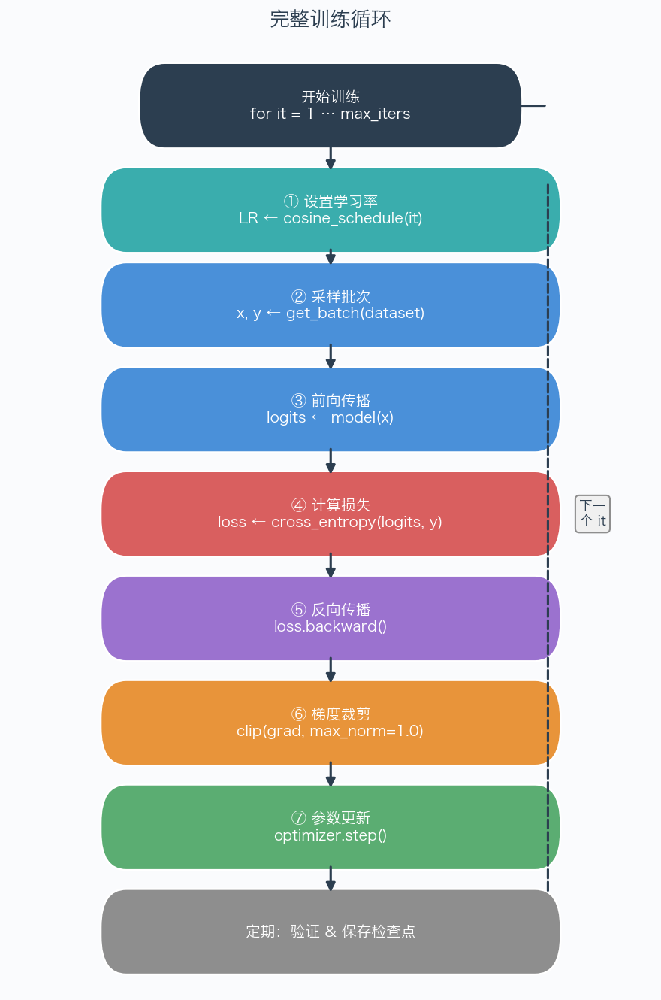

---

## 总结

下表汇总了五个文件的核心职责和关键技术：

| 文件 | 核心职责 | 关键技术 |
|------|----------|----------|
| `tokenizer.py` | 文本 ↔ 整数 ID 转换 | BPE 合并算法、增量更新、多进程、GPT-2 正则 |
| `nn_utils.py` | 神经网络基础组件 | RMSNorm、SwiGLU 门控、RoPE 旋转编码、因果注意力 |
| `model.py` | 组装完整语言模型 | Pre-norm 残差块、nn.ModuleList、LM Head |
| `optimizer.py` | 参数优化 | AdamW 自适应学习率、余弦调度、全局梯度裁剪 |
| `training.py` | 训练基础设施 | 数值稳定损失、批次采样、检查点、完整训练循环 |

每个模块都独立设计、可以单独测试，同时通过清晰的接口组合在一起，构成一个完整的"从零训练语言模型"的系统。
